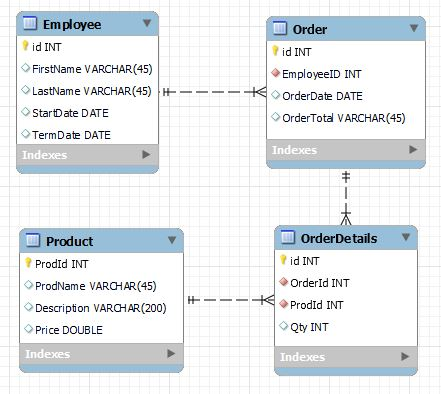

# Wood River Store
This project is a prototype for the small store with a very limited variety of items for the employees. The idea is to add employees with a same Employee Number as in the company's payroll system. Once employees do their purchases, data with totals spent by each employee will be added to payroll files for deduction processing. 

# Technologies used:
- Springboot  
- Maven  
- Java 
- Spring Data JPA  
- MariaDB  
- Thymeleaf  
- Lombok
- JUnit

# Models
There are 4 models: Employee, Product, Order and OrdeerDetails. Order contains a reference to the employee and total expense on the certain order, while OrderDetails contain more detailed information about the order, as particular products purchased and quantities for each item.
  

