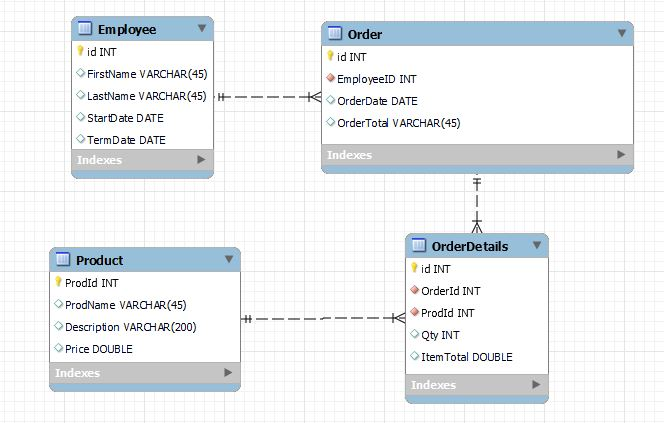

# Wood River Store
This project is a prototype for the small store with a very limited variety of items for the employees. The idea is to add employees with a same Employee Number as in the company's payroll system. Once employees do their purchases, data with totals spent by each employee will be added to payroll files for deduction processing. 

# Technologies used:
- Springboot  
- Maven  
- Java 
- Spring Data JPA  
- MariaDB  
- Thymeleaf  
- Lombok
- JUnit
  

